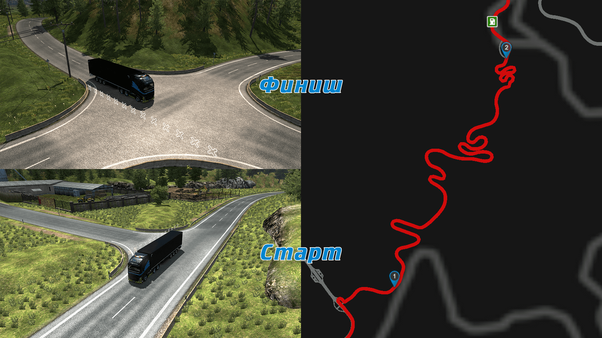
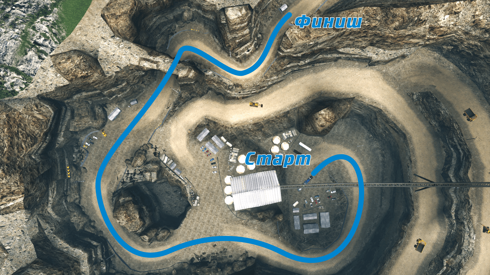

# Правила ВТК DreamOn
**Общие положения**
1. Данные Правила обязательны для соблюдения всеми участниками ВТК независимо от положения и должности.
1. Правила отражают специфические требования к поведению и некоторым особенностям игрового сообщества участников ВТК и не являются всеобъемлющими. В случаях, не предусмотренных Правилами, следует руководствоваться нормами этикета и здравого смысла.
1. Последней инстанцией, решающей вопросы формулировки, толкования и применения Правил, является Администрация ВТК.
1. Незнание установленных Правил не освобождает от ответственности.

**Положение о подаче заявки на вступление в ВТК**
1. Перед подачей заявки необходимо ознакомиться с данными Правилами.
1. Условия для вступления в ВТК:
    1. Вы достигли возраста 18 лет;
    1. Вы не состоите в другой ВТК;
    1. Вы ознакомились со всеми регламентами ВТК;
    1. Ваш никнейм Steam и никнейм TruckersMP не содержат нецензурную лексику или оскорбления, на любых языках;
    1. Вы имеете не менее двух DLC расширения карт; <sup>(Изменения от 30.01.2019)</sup>
    1. Вы имеете не более трёх активных банов на TruckersMP. <sup>(Изменения от 13.07.2020)</sup>

1. Возможные причины отказа:
    1. Вы указали неверный профиль Steam;
    1. Отсутствие профиля TrucersMP;
    1. Ваш возраст меньше 18 лет;
    1. Вы состоите в другой ВТК;
    1. Плохая репутация;
    1. Отсутствие требуемого количества DLC расширения карт. <sup>(Изменения от 30.01.2019)</sup>

1. Администрация ВТК оставляет за собой право отказа без объяснения причины. <sup>(Изменения от 30.01.2019)</sup>
1. Администрация ВТК оставляет за собой право принятия сотрудника при частичном невыполнении требований п.п.2.2 и п.п.2.3. <sup>(Изменения от 11.04.2019)</sup>
1. По просьбе администрации вы должны открыть свою историю банов на TruckersMP. <sup>(Изменения от 13.07.2020)</sup>

**Регламент использования аккаунта Steam, TruckersMP**

1. Перед Вашим никнеймом в TruckersMP обязательно должен находиться тег `[DreamOn]`.
1. Ваш никнейм в Steam должен соответствовать Вашему никнейму в TruckersMP (на выбор с тегом `[DreamOn]` или без). <sup>(Изменения от 17.12.2018)</sup>
1. Сотрудник должен изменить никнейм в TruckersMP в соответствии с пунктом Правил 3.1 в течение 3 дней с момента его вступления в компанию, в противном случае, данный сотрудник подлежит увольнению.
1. В случае невозможности смены никнейма в TruckersMP в обозначенный в пункте Правил 3.3 срок сотрудник обязан уведомить об этом Администрацию ВТК и установить мультиплеерный тег, а также сменить никнейм в TruckersMP при первой возможности.

**Регламент использования Discord**

1. Для обеспечения связи сотрудник должен установить клиент Discord (на ПК и/или мобильное устройство) и подключиться к серверу ВТК DreamOn по ссылке <https://vtc-dreamon.ru/>.
1. Ваш никнейм в Discord должен соответствовать Вашему никнейму в TruckersMP без тега. <sup>(Изменения от 11.04.2019)</sup>
1. Перед Вашим никнеймом в Discord обязательно должен находиться тег `[D-On]`. <sup>(Изменения от 14.10.2018)</sup>
1. Ваш микрофон должен быть в рабочем состоянии (не шуметь, не шипеть и т.д.).
1. Активация микрофона должна происходить по нажатию назначенной кнопки. <sup>(Изменения от 11.04.2019)</sup>
1. Сотрудник, имеющий право приоритетного собеседника, должен настроить соответствующую горячую клавишу в клиенте Discord.

**Регламент внешнего вида тягача и прицепов**

1. Официальное оформление тягачей и прицепов обязательно для всех сотрудников и устанавливается модификациями. <sup>(Изменения от 16.04.2019)</sup>
1. Допускается использование тягачей любых марок и моделей, но исключительно в фирменном оформлении ВТК.
1. Изменение вида и/или аксессуаров устанавливаемых для прицепа запрещено. <sup>(Изменения от 11.04.2019)</sup>

**Мероприятия компании**

1. К просмотру внутренних (закрытых) мероприятий компании имеет право только сотрудник ВТК DreamOn. <sup>(Изменения от 10.04.2019)</sup>
1. Запрещается распространять или публиковать маршруты, а также другую информацию о внутренних (закрытых) мероприятиях. Распространение любой информации о закрытом совместном конвое имеет право только сотрудник с должностью Логист и Администрация ВТК. <sup>(Изменения от 11.04.2019)</sup>
1. Быть ведущим, центрирующим или замыкающим имеет право только сотрудник ВТК сдавший экзамен на соответствующее положение в конвое.
1. Перед конвоем каждый сотрудник обязан выставить маршрут метками на своей карте в игре, произвести ремонт и дозаправку грузовика. <sup>(Изменения от 11.04.2019)</sup>
1. Во время любых мероприятий любой водитель должен подчиняться всем правилам ВТК DreamOn, TruсkersMP <https://truckersmp.com/rules>.

**Сотрудникам запрещено:**

```За невыполнение указанных требований сотруднику может грозить наказание в виде штрафа в размере от 1 до 10 баллов в зависимости от тяжести совершенного деяния (на усмотрение Администрации ВТК), или исключение из ВТК```

1. Запрещено копирование и использование в личных целях каких-либо материалов ВТК DreamOn (статьи, изображения, видео, модификации) и других авторских работ, отмеченных логотипом ВТК или автора без разрешения Администрации ВТК и/или автора работы; <sup>(Изменения от 16.04.2019)</sup>
1. Запрещено публиковать ссылки на какие-либо другие сообщества и ВТК без согласования с Администрацией ВТК DreamOn;
1. Запрещено публиковать фото/видео/ссылки насилия и/или порнографии;
1. Запрещено публиковать сообщения/фото/видео/ссылки, содержащие обсценную лексику, оскорбительные, националистические, хамские, непристойные и любые другие высказывания и информацию, которые нарушают морально-этические нормы, могут привести к разжиганию межнациональной розни и/или каким-либо образом затрагивать религиозные, национальные, политические, личностные качества, физиологические особенности/взгляды сотрудников ВТК; <sup>(Изменения от 16.04.2019)</sup>
1. Запрещено публиковать фото/видео/ссылки, запрещенные законодательством Российской Федерации;
1. Запрещено использовать любые нецензурные высказывания в игре, в никнейме, в Discord и в группе ВТК DreamOn; <sup>(Изменения от 16.04.2019)</sup>
1. Запрещено изменять никнейм без уведомления Администрации ВТК;
1. Вводить в заблуждение других сотрудников ВТК и/или Администрацию.

**Сотруднику разрешено:**

1. Использовать отпуск по согласованию с Администрацией ВТК;
1. Проявлять любую активность в ВТК, не противоречащую установленным Правилам;
1. Вносить любые предложения по улучшению ВТК;
1. Совершенствовать свое мастерство в вождении и помогать в этом другим;
1. Отстаивать свою точку зрения способами, не нарушающими установленные Правила ВТК;
1. Участвовать в игровых событиях в рамках ВТК.

**Обязанности сотрудника**

1. Выполнять установленные указания и регламенты.
1. Добросовестно выполнять указания Администрации. <sup>(Изменения от 10.04.2019)</sup>
1. Соблюдать максимально возможную концентрацию внимания на дороге.
1. Поддерживать свой тягач в надлежащем внешнем виде и техническом состоянии, особенно во время конвоев.
1. Выполнять требования установленных ПДД, а также игровых правил TruckersMP (<https://truckersmp.com/rules>).
1. На любом открытом мероприятии каждый сотрудник ВТК DreamOn обязан находиться на 15 канале игровой рации.
1. Уведомить Администрацию ВТК об изменении (пополнении) списка имеющихся DLC. <sup>(Изменения от 15.10.2018)</sup>

**Баллы, стаж и должности**

1. За участие в конвоях Компании сотруднику начисляются баллы:
    * За преодоление части конвоя компании – 1 балл;
    * За преодоление конвоя компании – 2 балла.
1. Сотруднику назначается должность согласно количеству полученных им баллов и при условии сдачи экзаменационных испытаний: <sup>(Изменения от 25.08.2018)</sup>
    * Испытательный срок – 0 баллов;
    * Стажер – 18 баллов;
    * Водитель 3й категории – 36 баллов;
    * Водитель 2й категории – 72 балла;
    * Водитель 1й категории – 144 баллов;
    * Старший водитель – 288 баллов.
1. Установленные Администрацией ВТК экзаменационные испытания представлены в [Приложении 2](#append2).
1. Продолжительность испытательного срока составляет 3 недели. Сотрудник, не набравший необходимое количество баллов за указанный срок, подлежит увольнению. <sup>(Изменения от 16.12.2018)</sup>
1. Сотрудник, не принимающий участия в конвоях в течении 3 месяцев, без уважительной причины, подлежит увольнению. <sup>(Изменения от 11.04.2019)</sup>

**Манифест**

1. Мы гарантируем отстаивание интересов наших сотрудников в пространстве игрового мира и перед другими ВТК.
1. Мы гарантируем справедливый разбор конфликтных ситуаций как между сотрудниками ВТК, так и между сотрудником и представителями Администрации ВТК.
1. Мы гарантируем рассмотрение любого предложения и идеи для улучшения процессов в ВТК.
1. Мы гарантируем постоянную организацию различных мероприятий в игровом мире.
1. Мы гарантируем урегулирование любых конфликтных ситуаций с другими ВТК.
1. Мы гарантируем, что любая личная информация о наших сотрудниках не будет распространена при любых возможных ситуациях, даже после увольнения сотрудника.

# <a name="append1"></a> Приложение 1 - Термины и сокращения {#append1}

* ВТК – Виртуальная Транспортная Компания
* ПДД – Правила Дорожного Движения
* Discord – бесплатный мессенджер с поддержкой VoIP и видеоконференций, изначально ориентированный для пользователей компьютерных игр
* DLC – (англ. Downloadable content) форма распространения официального цифрового медиа контента через Интернет. Дополнение для игры


# <a name="append2"></a> Приложение 2 - Экзаменационные испытания

## Испытательный срок

Экзаменационные испытания не предусмотрены.


## Стажер

Экзаменационные испытания не предусмотрены.


## Водитель 3й категории

### Требования к грузовику и грузу

При прохождении экзаменационного задания используется:

* Грузовик марки Volvo FH (2012 года) со следующими характеристиками:

    * двигатель – *D13C500 Euro 6 / EEV*
    * шасси – *6x4*
    * трансмиссия – *I-Shift ATO3512D R*

* Груз - *Бобы, 11 тонн*.

### Подготовка к выполнению экзаменационного задания

Прибыть на точку старта в районе города *Милан (Milano), Италия*.

### Выполнение экзаменационного задания

Преодолеть дистанцию до точки финиша за время не более 8 минут. Грузовик, прицеп и груз не должны быть повреждены.

### Схема движения




## Водитель 2й категории

### Требования к грузовику и грузу

При прохождении экзаменационного задания используется:

* Грузовик марки Volvo FH (2012 года) со следующими характеристиками:
    * двигатель – *D13C420 Euro 5 / EEV*
    * шасси – *6x4*
    * трансмиссия – *I-Shift ATO3512D R*
* Груз - *Локомотив, 61 тонна*.

### Подготовка к выполнению экзаменационного задания

Прибыть на точку старта (база *Stein Bruch*) в районе города *Дортмунд (Dortmund), Германия*.

### Выполнение экзаменационного задания

Начиная с нижнего яруса карьера подняться на верхний ярус и покинуть базу.

### Схема движения




## Водитель 1й категории

### Требования к грузовику и грузу

При прохождении экзаменационного задания используется:

* Грузовик марки Volvo FH (2012 года) со следующими характеристиками:
    * двигатель – *D13C500 Euro 5 / EEV*
    * шасси – *6x4*
    * трансмиссия – *I-Shift ATO3512D R*
* Груз - *Автокран Rex-Tex 45, 36 тонн*.

### Подготовка к выполнению экзаменационного задания

Прибыть на точку старта (база *Nordic Stenbrott*) в районе города *Векшё (Växjö), Швеция.*.

### Выполнение экзаменационного задания

Припарковать груз двигаясь задним ходом согласно схеме.

### Схема движения


## Старший водитель

*в разработке*


# <a name="append3"></a> Приложение 3 - Правила поведения участников на конвое

* Перед началом конвоя ведущий устанавливает порядок участников, назначает центрирующего и замыкающего. При необходимости участники могут озвучить свои пожелания по размещению в колонне.
* Во время движения колонны участники должны занимать свои места, согласно установленному порядку. Изменение места в колонне допустимо только с разрешения ведущего.
* Участники должны соблюдать скоростной режим, сохранять дистанцию от впереди идущей машины достаточную для совершения манёвра, основываясь на скоростном режиме и условиях движения.
* Участникам запрещено использование проблесковых маячков, за исключением ведущего, центрирующего и замыкающего. <sup>(Изменения от 11.04.2019)</sup>
* Участник колонны, которому требуется остановка или дозаправка, должен оповестить об этом ведущего.
* Возвращаясь в колонну после остановки или дозаправки, участник должен оповестить об этом замыкающего, после чего занять своё место в колонне согласно установленному порядку.
* Во время продолжительных остановок участники должны отключить задний ход и проблесковые маяки, а также заглушить двигатель. При покидании игрового места (AFK) участники должны включать сигналы аварийной остановки, а по возвращению – отключать их.
* Во время движения колонны приоритет в голосовом канале отдаётся ведущему, центрирующему и замыкающему. Мешать обозначенным лицам во время озвучивания ими служебной информации запрещено. Участник, неоднократно нарушающий данное правило, будет заглушён.
* Использование игровой рации без необходимости запрещено, за исключением случаев приветствия других игроков, озвучивания благодарности и т.п. Использование игровой рации для ругани (вне зависимости от ситуации) с другими игроками запрещено.